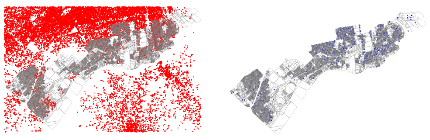

# **Real Estate Modeller

Python tools for Real Estate market analysis

* Root

```
virtualenv venv --python=python3.10
source venv/bin/activate
pip install -r requirements.txt

```
* Develop mode

```
virtualenv venv --python=python3.10
source venv/bin/activate
python setup.py develop
pip install -r requirements-dev.txt

```

**Price patterns**

Train models based on observed point patterns to predict:

 * urban land value usd/m2,
 * built usd/m2,
 * residential and non-residential usd/m2,

The following example shows `XGboost` estimation for parcels land value:

1. Downloads a Real Estate dataset to match `Point` and `Polygon` geometries 


2. Group average values at Polygon level, train your model and predict your blanks
<p float="right">
  
  
</p>
